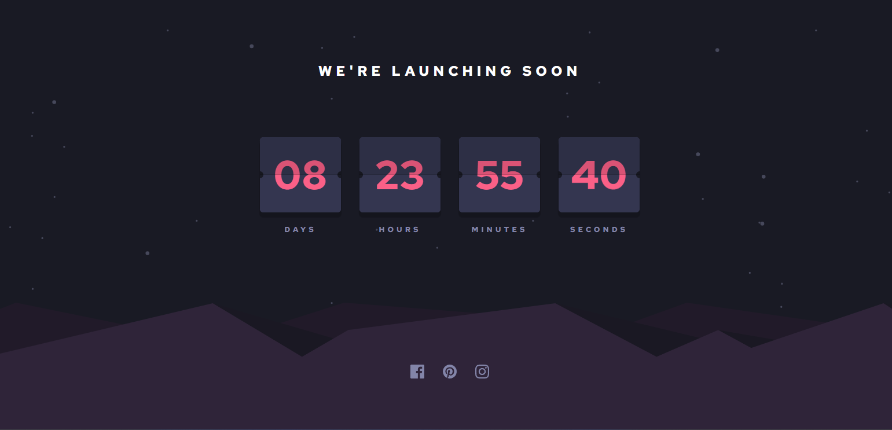

# Frontend Mentor - Launch countdown timer solution

This is a solution to the [Launch countdown timer challenge on Frontend Mentor](https://www.frontendmentor.io/challenges/launch-countdown-timer-N0XkGfyz-). Frontend Mentor challenges help you improve your coding skills by building realistic projects.

## Table of contents

- [Overview](#overview)
  - [The challenge](#the-challenge)
  - [Screenshot](#screenshot)
  - [Links](#links)
- [My process](#my-process)
  - [Built with](#built-with)
  - [What I learned](#what-i-learned)
  - [Useful resources](#useful-resources)
- [Author](#author)

## Overview

### The challenge

Users should be able to:

- See hover states for all interactive elements on the page
- See a live countdown timer that ticks down every second (start the count at 14 days)
- **Bonus**: When a number changes, make the card flip from the middle

### Screenshot

### Links

- Solution URL: [Solution](https://www.frontendmentor.io/solutions/launch-countdowntimer-app-using-react-vite-and-tailwindcss-x7fx6JdKDR)
- Live Site URL: [Live](https://coutdown-timer298.web.app/)

## My process

### Built with

- Semantic HTML5 markup
- CSS custom properties
- Flexbox
- CSS Grid
- Mobile-first workflow
- [React](https://reactjs.org/) - JS library
- [Tailwind CSS](https://tailwindcss.com) - CSS framework

### What I learned

This was a fun and challenging project for me. specially the css part. there was a lot of small designs to implement which were not so easy. it really enhanced my knowledge of styling small but neat designs.

## Author

- Frontend Mentor - [@servant-of-Allah](https://www.frontendmentor.io/profile/servant-of-Allah)
- Twitter - [@RobotRo63104](https://www.twitter.com/RobotRo63104)
